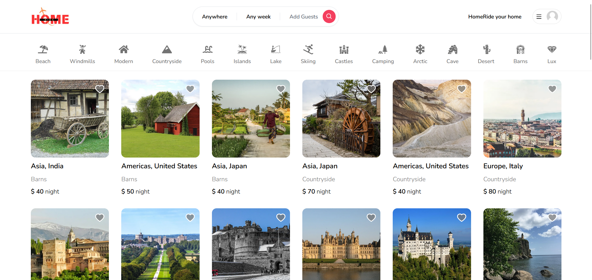
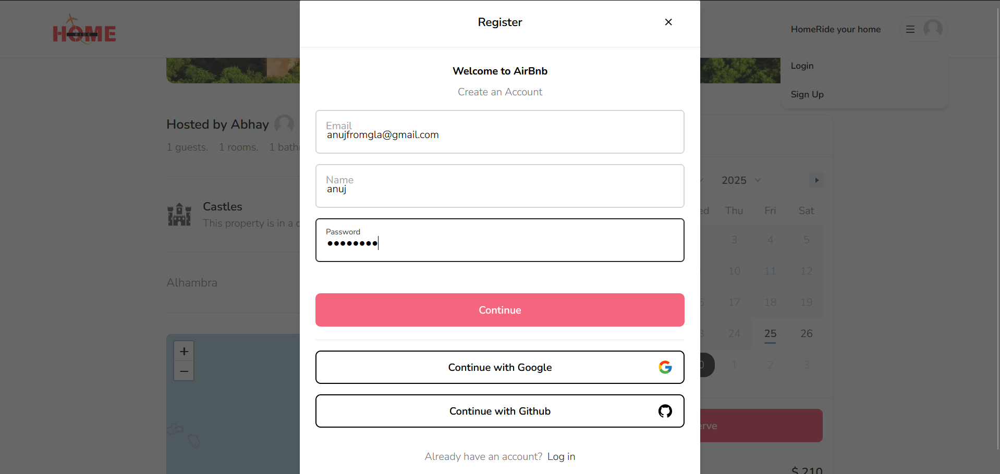
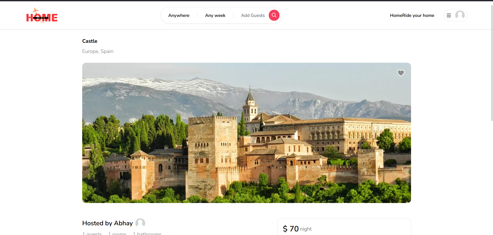
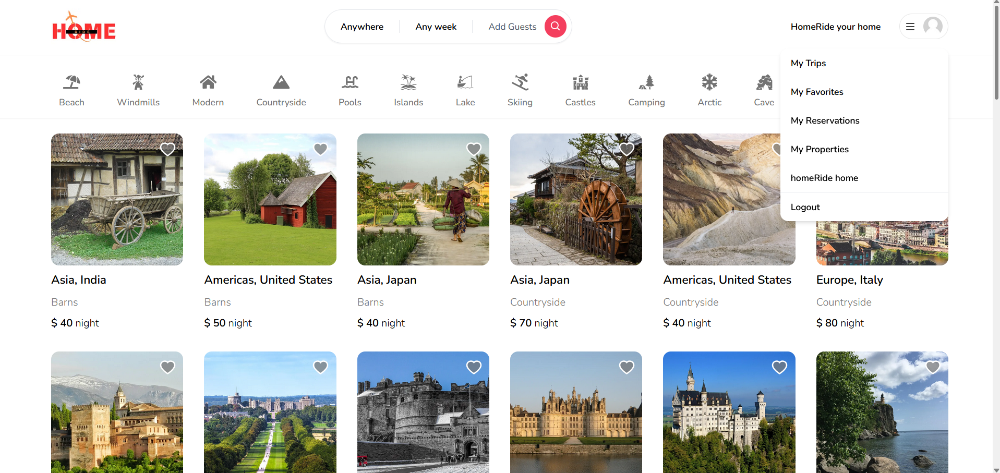
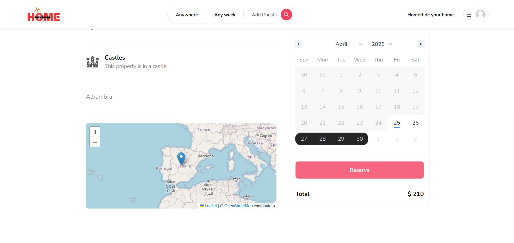

<h1 align="center">🏠 HomeRide</h1>
<p align="center">Your perfect place to stay, wherever you go ✨</p>

<p align="center">
  
</p>

---

## 🚀 Project Overview

**HomeRide** is a modern and fully responsive accommodation booking platform built with the latest technologies. Users can register, list their homes, book stays, and explore unique places across the world — all in a clean and intuitive UI.

---

## 🧰 Tech Stack

| Category            | Technology Used        |
|---------------------|------------------------|
| 🖥 Frontend         | Next.js                |
| 🧠 Backend          | Prisma ORM             |
| 🛢 Database         | MongoDB Atlas          |
| ☁️ Media Storage    | Cloudinary             |
| 🔐 Authentication   | Google & GitHub OAuth  |
| 🎨 Styling          | Tailwind CSS           |

---

## 🔐 Authentication

HomeRide supports modern OAuth login mechanisms:

- ✅ Sign in with **Google**
- ✅ Sign in with **GitHub**

> Fast, secure, and no password required!

---

## 📸 UI Screenshots

### 🏡 Home Page


---
### 🔑 Sign In Page


---

### 📝 Property view


---

### 👤 User Menu  



### 📅 Booking Page


---

## 📂 Folder Structure
HomeRide/
├── public/
│   └── images/
│       ├── authentication.png
│       ├── homelogo.png
│       ├── Homepage.png
│       ├── placeholder.jpg
│       ├── properties.png
│       ├── reservation.png
│       └── usermenu.png
├── prisma/
├── pages/
├── app/
├── .env
├── README.md
├── tailwind.config.ts
├── next.config.js
├── package.json
└── ...


---

## 📦 Features

- 🌍 Explore stays across the world
- 🧾 Book instantly & securely
- 🔑 Google and GitHub OAuth authentication
- 🏡 Host your own properties
- 📸 Image uploads powered by **Cloudinary**
- 🔍 Clean and modern UI

---

## 🛠️ Getting Started

### 1️⃣ Clone the Repository

```bash
git clone https://github.com/ianujpatel/HomeRide.git
cd homeride
```

### 2️⃣ Install Dependencies

```bash
npm install
```

###3️⃣ Configure .env File

```bash
DATABASE_URL=your_mongodb_atlas_url
CLOUDINARY_CLOUD_NAME=your_cloudinary_name
CLOUDINARY_API_KEY=your_api_key
CLOUDINARY_API_SECRET=your_api_secret
NEXTAUTH_SECRET=your_auth_secret
NEXTAUTH_URL=http://localhost:3000
GITHUB_ID=your_github_client_id
GITHUB_SECRET=your_github_client_secret
GOOGLE_CLIENT_ID=your_google_client_id
GOOGLE_CLIENT_SECRET=your_google_client_secret
```

4️⃣ Run Locally

```bash
npm run dev
```

### 🌐 [Live Demo](https://home-ride.vercel.app/)
🧪 Hosted on: Vercel